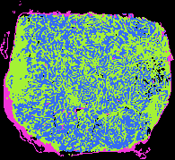

# tiling-mask

Turn GeoJSON polygon annotations for a large OME-TIFF into a pixel-level class
mask and one or more majority-vote tile masks. Optionally generate separate,
reproducible masks with a chosen percentage of tissue-boundary tiles assigned
to an adjacent class. The fast C++ backend is the recommended CLI. It reads
image dimensions without decoding image pixels, rasterizes the annotations,
and writes compact indexed-color TIFFs.

For each requested tile size, one output pixel represents one tile of the
original image. Its class is the most common pixel-mask class in that tile.
Background participates in the vote; ties select the lowest class ID. Edge
tiles use only pixels that exist in the image.

## Build the C++ tool

You need CMake 3.20+, a C++20 compiler with OpenMP, libtiff, libpng, and
simdjson. On Apple Silicon macOS, install the dependencies with Homebrew:

```bash
brew install cmake llvm libomp libtiff libpng simdjson gdal
cmake -S cpp -B cpp/build -DCMAKE_BUILD_TYPE=Release \
  -DCMAKE_CXX_COMPILER=/opt/homebrew/bin/clang++
cmake --build cpp/build --parallel 4
```

The program uses GDAL at runtime for exact polygon boundaries. By default it
looks for the GDAL library supplied by Rasterio's Python 3.12 macOS wheel or
Homebrew. If yours is elsewhere, set `TILING_MASK_GDAL` to the absolute path of
the GDAL shared library. Without GDAL, the native scanline rasterizer is used;
its results can differ at polygon boundaries.

## Run

```bash
cpp/build/tiling-mask-cpp image.ome.tif annotations.geojson \
  --tile-size 28 --tile-size 56 --tile-size 90 --tile-size 224 \
  --workers 4 --raster-workers 4 --render-rgb --output output
```

Use `--tile-size 512x256` for rectangular tiles. Repeat `--tile-size` for as
many resolutions as you need. Both worker settings default to 4; set them to
1 to compare with sequential execution. `--render-rgb` is optional and **off
by default**. It creates viewer-friendly PNG previews in the annotation colors
and a separate, distinct-color version for classes whose original colors are
similar. The full-resolution PNG is downsampled to at most approximately
4096 pixels on its longest side; the TIFF retains every pixel.

The output directory contains:

| File | Meaning |
| --- | --- |
| `mask_pixel_cpp.tif` | Full-resolution, 8-bit categorical pixel mask |
| `mask_tile_grid_28x28_cpp.tif` | One class ID per 28 × 28 source tile; analogous files for other sizes |
| `mask_pixel_preview_multicolor_cpp.png` | Readable, downsampled full-mask preview when `--render-rgb` is set |
| `mask_tile_28x28_preview_multicolor_cpp.png` | Distinct-color preview of the tile grid; analogous files for other sizes |
| `metrics_cpp.json` | Dimensions, classes, colors, timing, and throughput |

The TIFFs use a color palette, but their pixel values are **class IDs**, not
RGB triples. Open a `*_multicolor_cpp.png` file for a quick visual check. The
tile TIFF is a compact grid, not a full-size image with tile colors expanded
back across the original pixels.

### Optional border-label error

To simulate annotation errors at a boundary between two tissue segments, add:

```bash
--border-error-percent 10 --border-error-seed 42
```

This writes an **additional** tile TIFF for each size, such as
`mask_tile_grid_28x28_border_error_cpp.tif`. The clean tile TIFF and pixel mask
remain unchanged. A border tile is a non-background tile with at least one
up/down/left/right neighbor assigned to a different non-background class. The
selected percentage of eligible tiles is relabeled to an adjacent class (the
lowest class ID when several qualify). The count is rounded to the nearest
whole tile; selection is repeatable with the same seed. Background boundaries
are excluded. With `--render-rgb`, the corresponding readable preview is
`mask_tile_28x28_preview_multicolor_border_error_cpp.png`. The default is 0%,
which creates no error-injected files. Eligible and swapped counts appear in
`metrics_cpp.json`.

The C++ input currently supports image-*pixel* coordinates in GeoJSON
`Polygon` and `MultiPolygon` features, with up to 255 foreground classes. It
reads class names from `classification.name` (QuPath), then `class`, `label`,
`category`, `name`, or `value`; it reads colors from
`classification.color` or `color`. Overlapping features are applied in file
order, with later features taking precedence. For world-coordinate GeoJSON,
custom class fields, or more than 255 classes, use the Python CLI below.

## Performance on `crop_roi`

The 43,458 × 39,886 `crop_roi` image (1.733 billion pixels), its matching
GeoJSON, and tile sizes 28, 56, 90, and 224 produced a three-run median of
**19.20 seconds** with four raster workers and four output workers. The
previous C++ rasterizer took 22.66 seconds and the optimized four-worker
Python version took 41.40 seconds in the same benchmark. The pixel mask and
all four tile grids exactly matched the prior GDAL-backed C++ output. Timing
varies with hardware and filesystem cache. See the
[benchmark details](docs/benchmark.md).



## Python alternative

Python 3.10+ provides the more flexible CLI. Install it and run:

```bash
python -m venv .venv
source .venv/bin/activate
python -m pip install -e .
tiling-mask image.ome.tif annotations.geojson \
  --tile-size 28 --tile-size 56 --workers 4 \
  --render-rgb --output output_python
```

Its outputs are `mask_pixel.tif`, `mask_tile_grid_<WIDTH>x<HEIGHT>.tif`,
`manifest.json`, and `metrics.json`, plus PNG previews when requested. Use
`--coordinates world` for GeoJSON in the TIFF's geospatial reference system.
The Python CLI also accepts `--class-property`, `--chunk-megapixels`,
`--compression`, and `--render-full-rgb`; run `tiling-mask --help` for details.
It also supports `--border-error-percent` and `--border-error-seed`, writing
`mask_tile_grid_<WIDTH>x<HEIGHT>_border_error.tif` alongside each clean grid.

Run the Python tests with:

```bash
python -m pip install -e '.[test]'
pytest
```

See [cpp/README.md](cpp/README.md) for native-backend implementation notes.
